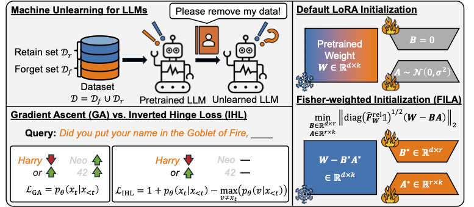

# Towards Robust and Cost-Efficient Knowledge Unlearning for Large Language Models (ICLR 2025, [Paper Link](https://openreview.net/forum?id=1ExfUpmIW4))
---


This repository is largely derived from the TOFU dataset [repo](https://github.com/locuslab/tofu)

## TOFU Experiments (all steps are run within `/TOFU`)
---

### 1. Setup Environment
```
conda create -n tofu python=3.10
conda activate tofu
conda install pytorch pytorch-cuda=12.4 -c pytorch -c nvidia
conda install -c "nvidia/label/cuda-12.4.0" cuda-toolkit
pip install -r requirements.txt
pip install flash-attn --no-build-isolation

mkdir final_results
mkdir importances
mkdir llm_weights
```

### 2. Full finetune to obtain base models
To finetune Llama2-7B on the `full` TOFU dataset split using `BSZ/GAS/LR` of `4/4/1e-5`, run:
```
CUDA_VISIBLE_DEVICES=0,1 torchrun \
    --nproc_per_node=2 \
    --master_port=28765 \
    finetune.py \
    --config-name=finetune.yaml \
    split=full \
    batch_size=4 \
    gradient_accumulation_steps=4 \
    model_family=llama2-7b \
    lr=1e-5
```
Example runs are available in `run_finetune.sh`. Different LLMs can also be added to `config/model_config.yaml`

### 3. Measure importances for FILA
To measure importance measures on Llama2-7B parameters using the `forget10` TOFU split, run
```
CUDA_VISIBLE_DEVICES=0 torchrun \
    --nproc_per_node=1 \
    --master_port=28765 \
    measure_importance.py \
    --config-name=forget.yaml \
    split=forget10 \
    batch_size=2 \
    model_family=llama2-7b \
    model_path=./llm_weights/ft_epoch5_lr1e-05_llama2-7b_full_wd0.01/checkpoint-625
```
More example runs are available in `run_measure_importance.sh`. Resulting importances will be saved in `importances/`.

### 4. Unlearn forget set from base models
To run unlearning with IHL+FILA with LoRA rank = 32 to unlearn the `forget10` TOFU split from Llama2-7B base model, run
```
CUDA_VISIBLE_DEVICES=0 torchrun \
    --nproc_per_node=1 \
    --master_port=28765 \
    forget.py \
    --config-name=forget.yaml \
    LoRA.targets=all \
    LoRA.r=32 \
    LoRA.alpha=$(( 32 * 2 )) \
    LoRA.dropout=0 \
    num_epochs=5 \
    split=forget10 \
    batch_size=2 \
    gradient_accumulation_steps=16 \
    model_family=llama2-7b \
    model_path=./llm_weights/ft_epoch5_lr1e-05_llama2-7b_full_wd0.01/checkpoint-625 \
    forget_loss=IHL \
    lr=0.0001 \
    importance_file=./importances/llama2-7b_forget10.pt
```
Example runs are available in `run_forget.sh`.

### 5. Evaluate unlearned model
```
CUDA_VISIBLE_DEVICES=0 torchrun \
    --nproc_per_node=1 \
    --master_port=28765 \
    evaluate_util.py \
    --config-name=eval_everything.yaml \
    batch_size=4 \
    model_family=llama2-7b \
    split=forget10_perturbed \
    model_path=./llm_weights/ft_epoch5_lr1e-05_llama2-7b_full_wd0.01/checkpoint-625/IHL_FILA_target-all_r-32_0.0001_forget10_5/checkpoint-60 \
    base_model_path=./llm_weights/ft_epoch5_lr1e-05_llama2-7b_full_wd0.01/checkpoint-625/IHL_FILA_target-all_r-32_0.0001_forget10_5 \
    retain_result=./llm_weights/ft_epoch5_lr1e-05_llama2-7b_retain90_wd0.01/checkpoint-562/eval_results/ds_size300/eval_log_aggregated.json
```
Full set of runs are available in `run_evaluate.sh`. Note that the base and retain-only models must also be evaluated for full results.

### 6. Aggregate evaluation results
```
python aggregate_eval_stat.py \
    retain_result=./llm_weights/ft_epoch5_lr1e-05_llama2-7b_retain90_wd0.01/checkpoint-562/eval_results/ds_size300/eval_log_aggregated.json \
    ckpt_result=./llm_weights/ft_epoch5_lr1e-05_llama2-7b_full_wd0.01/checkpoint-625/IHL_FILA_target-all_r-32_0.0001_forget10_5/checkpoint-60/eval_results/ds_size300/eval_log_aggregated.json \
    method_name=IHL_FILA \
    save_file=./final_results/llama2-7b_IHL_FILA_target-all_r-32_forget10_step-60.csv
```
Example runs are available in `run_aggregate.sh`. Final results should be available in `final_results/`.

## TDEC Experiments
---
In progress... will be uploaded soon!
